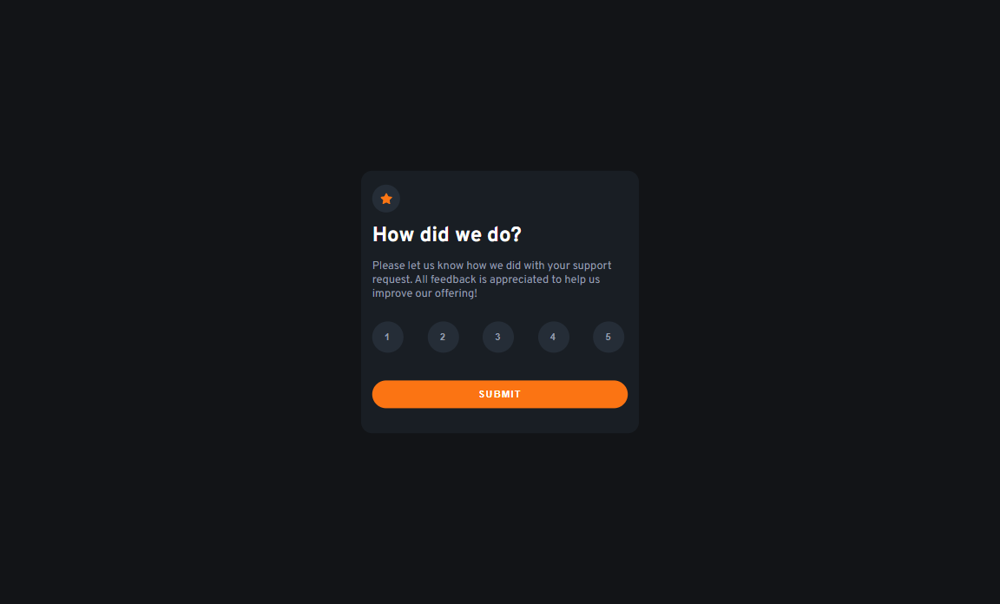
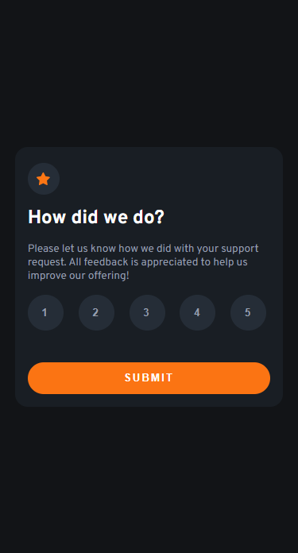

# Interaction Rating Component

This is an interaction rating component built with ReactJS and styled components. It allows users to rate their experience on a scale of 1-5 stars.

## Features
- Responsive design
- Animated hover effects on the rating icons
- Slide-in animation on the component
- Easy to customize and integrate into your project

## Technologies Used
- ReactJS
- styled components

## Screenshots
|  |  |
| ------------------------------ | ----------------------------- |
| Desktop version                | Mobile version                |

## Getting Started
1. Clone or download the repository
2. Navigate to the project directory in your terminal
3. Run `npm install` to install the necessary dependencies
4. Run `npm start` to start the development server
5. The component will be available at http://localhost:3000

